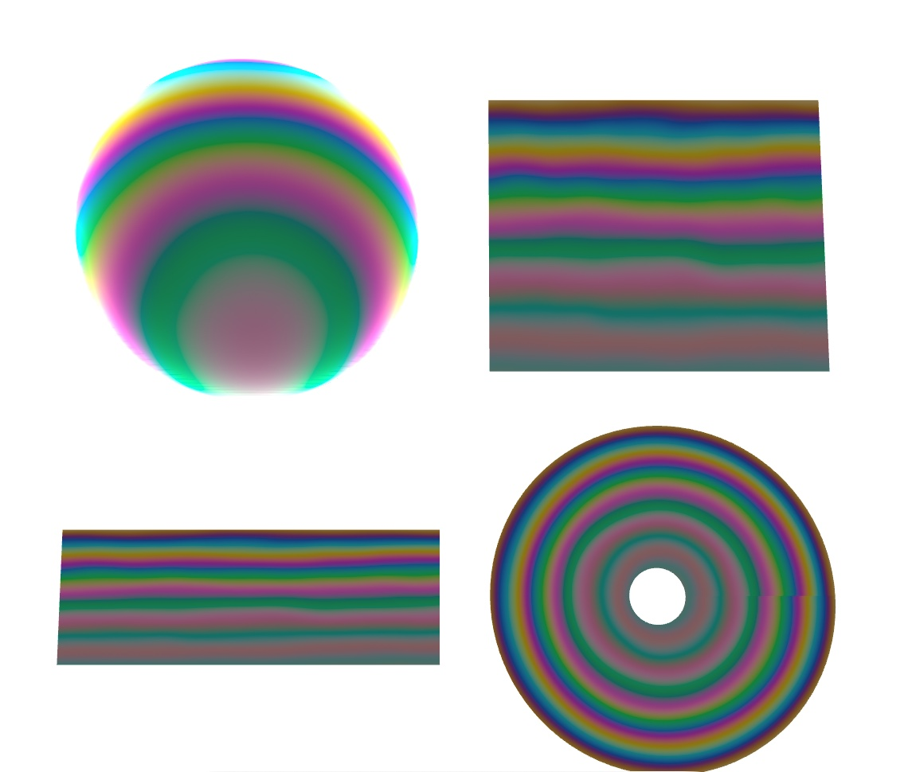
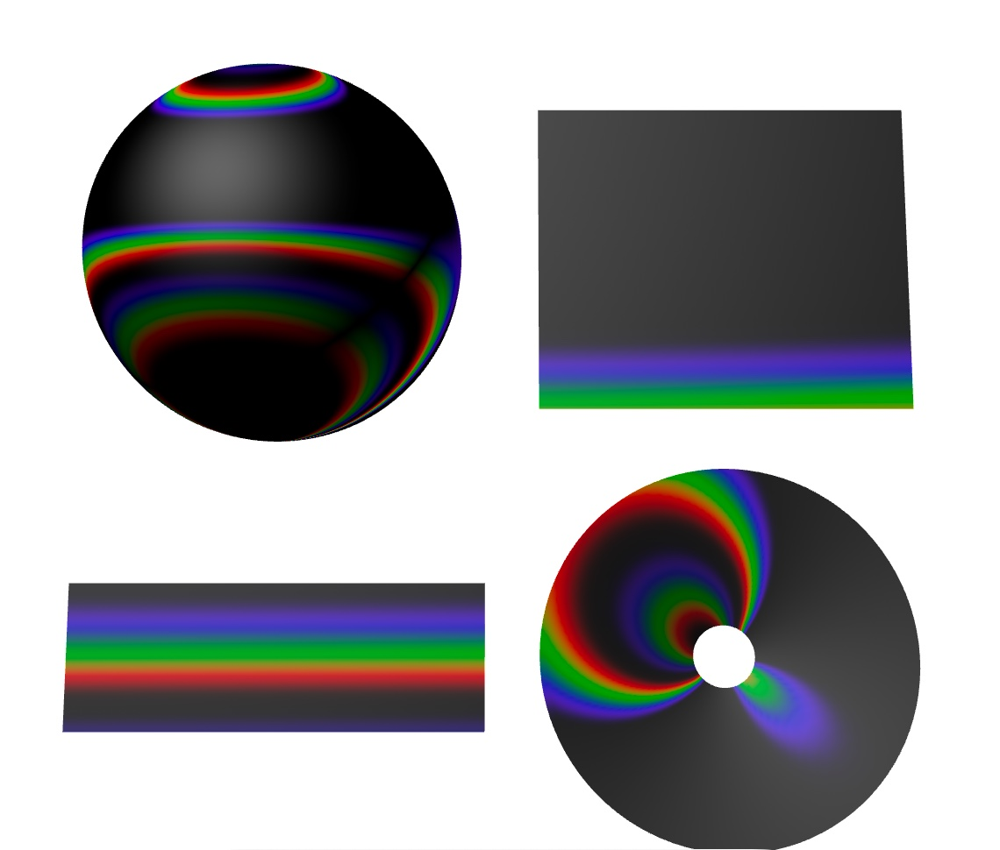
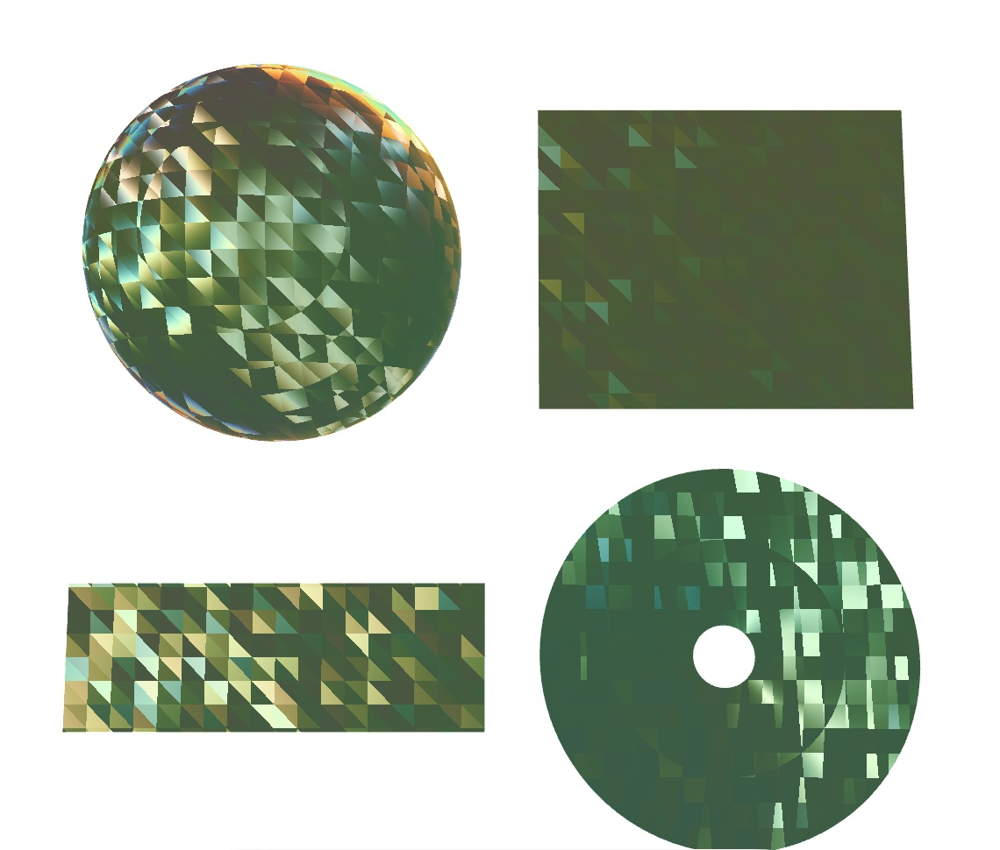
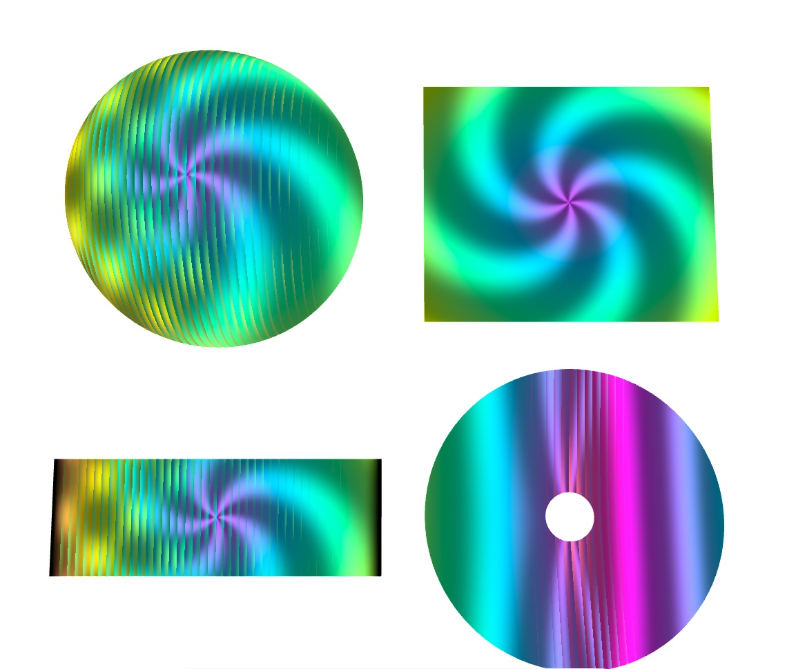
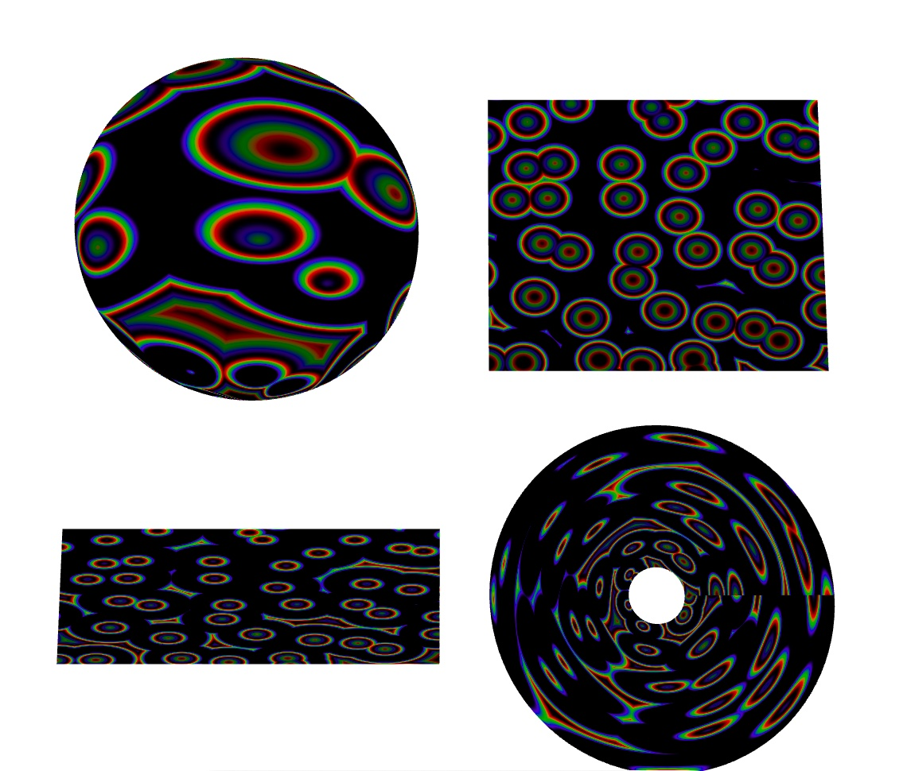
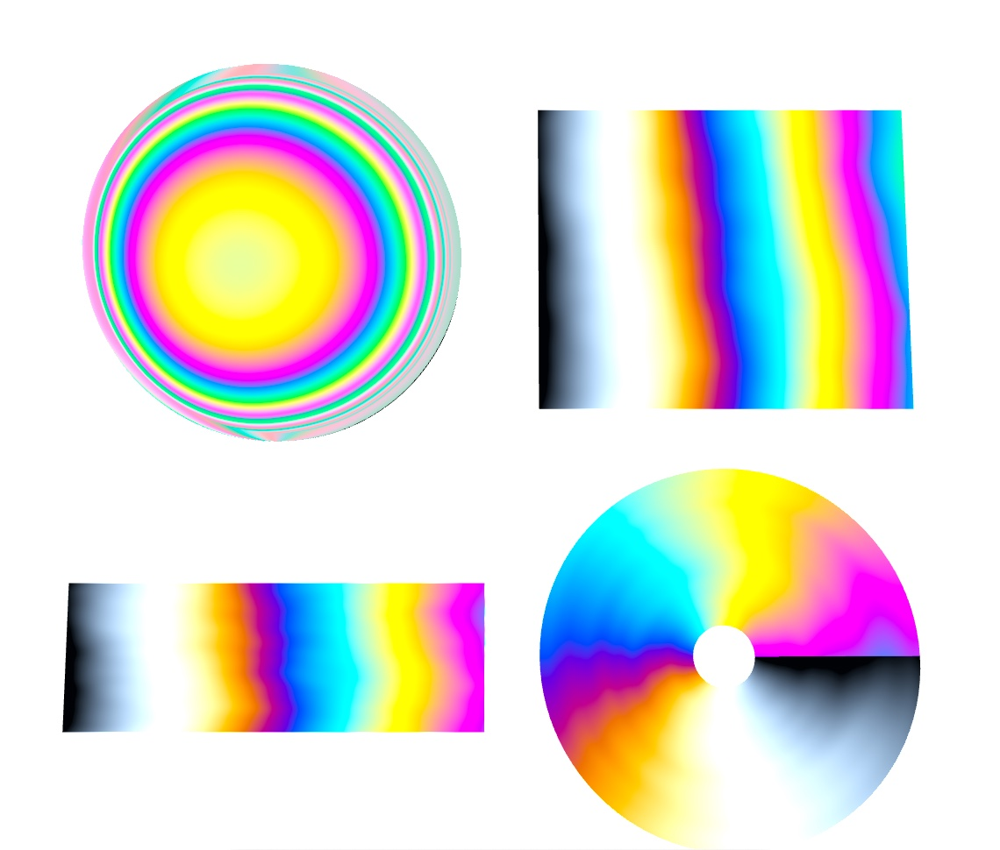
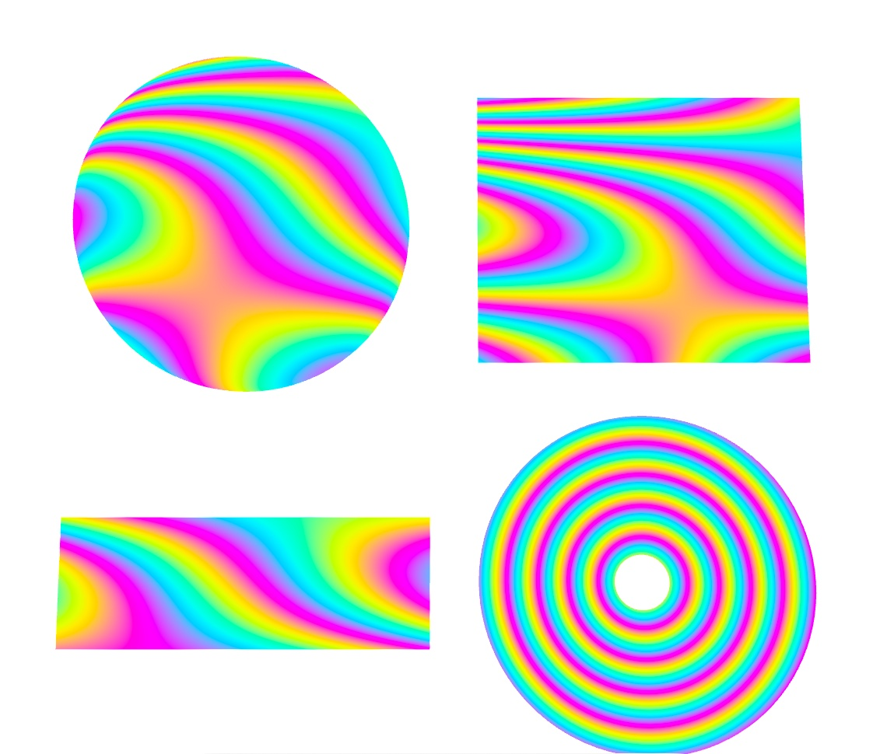
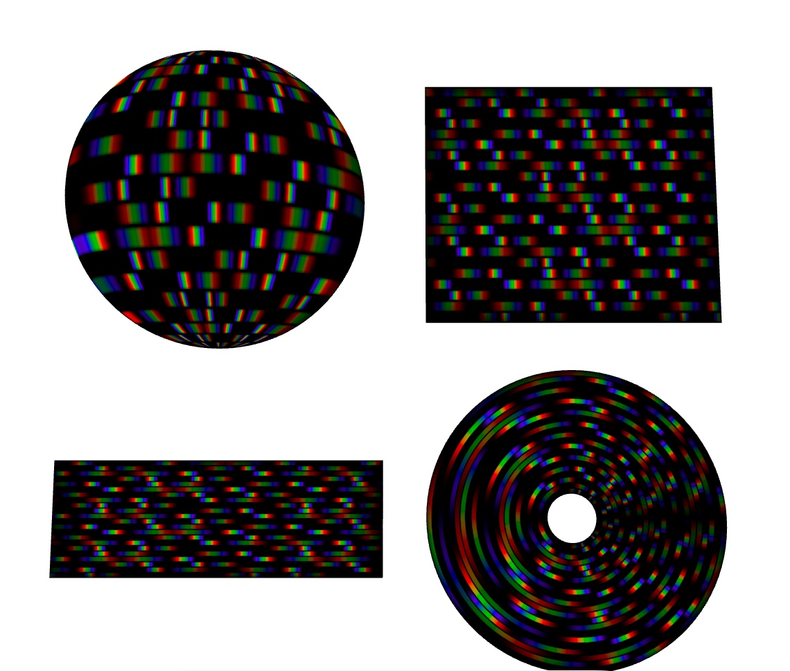
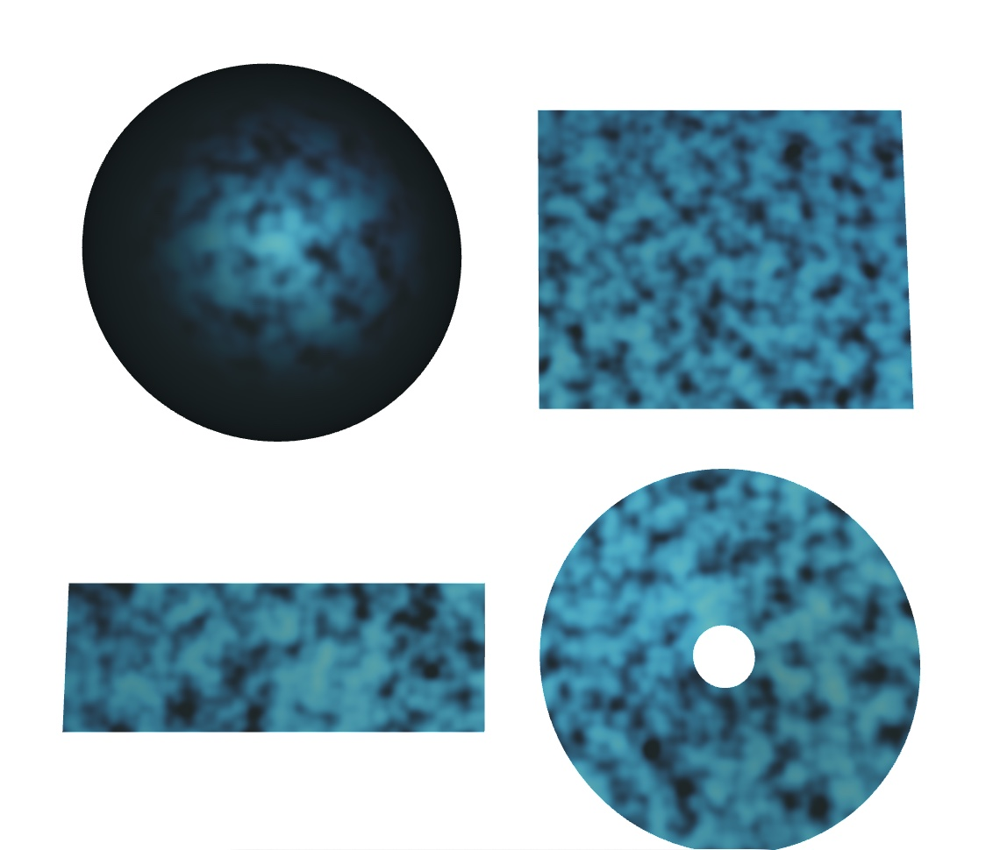
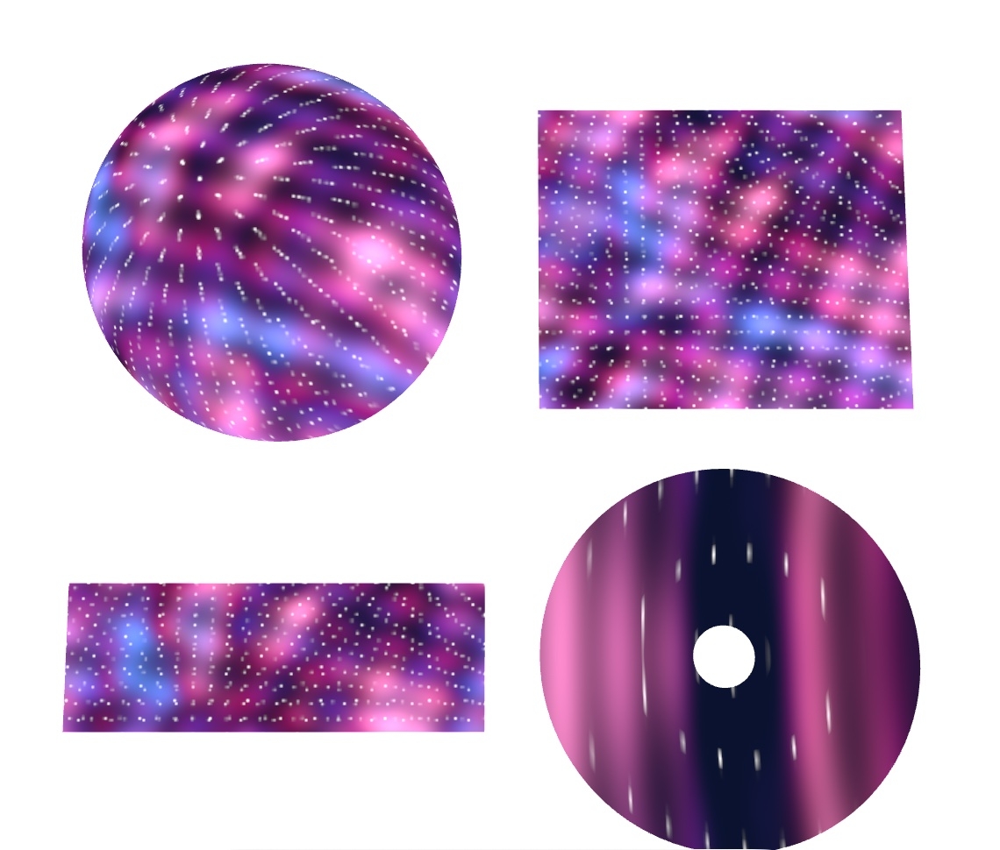

# RealityOpticsShaderLab

[中文](#中文) · [English](#english)

## iPhone 效果截图 / iPhone Shader gallery

以下图片取自 iPhone 17 Pro 模拟器，仅展示球体、平面、尺子和光盘上的 Shader 效果；点击可查看原始尺寸。 / These iPhone 17 Pro simulator crops show the Shader on the sphere, plane, ruler, and disc. Click for the full-size image.

| 效果 / Effect | 效果 / Effect |
|---|---|
| **薄膜干涉 · 肥皂泡 / Thin-Film Interference**<br><a href="docs/images/effects/thinFilm.jpg"></a> | **衍射光栅 · 光盘 / Diffraction Grating**<br><a href="docs/images/effects/grating.jpg"></a> |
| **宝石火彩 / Gemstone Fire**<br><a href="docs/images/effects/gemFire.jpg"></a> | **柱镜变图 / Lenticular Images**<br><a href="docs/images/effects/lenticular.jpg"></a> |
| **欧泊变彩 / Opal Play-of-Color**<br><a href="docs/images/effects/opal.jpg"></a> | **双折射 · 光弹性 / Birefringence**<br><a href="docs/images/effects/birefringence.jpg"></a> |
| **彩色莫尔纹 / Color Moiré**<br><a href="docs/images/effects/moire.jpg"></a> | **彩虹全息图 / Rainbow Hologram**<br><a href="docs/images/effects/hologram.jpg"></a> |
| **拉长石晕彩 / Labradorite Labradorescence**<br><a href="docs/images/effects/labradorite.jpg"></a> | **视差星云 / Parallax Nebula**<br><a href="docs/images/effects/parallaxNebula.jpg"></a> |

## 中文


支持 visionOS 与 iOS 18+、基于 RealityKit ShaderGraph 与 Metal Compute 的光学效果库，实时展示 35 种光学与结构色效果。手机使用 `RealityOpticsShaderLab-iOS` Scheme。

### 效果清单

下表按分组概括共同原理，并逐项描述视觉效果。同组效果不一定使用完全相同的物理机制。

| 分组 | 共同的基本原理 | 效果及视觉表现 |
|---|---|---|
| 薄膜与镀膜（7） | 薄层界面的反射光发生干涉；膜厚和视角改变时，被增强的颜色随之变化。 | **薄膜干涉／肥皂泡**：随膜厚变化的彩虹色；**油膜**：水面流纹状彩色；**阳极氧化钛**：氧化层厚度形成鲜明金属色；**镜头镀膜**：微弱的紫绿反光；**二向色玻璃**：反射与透射呈互补色；**牛顿环**：同心彩环；**蜻蜓翅膀**：半透明翅膜上的淡虹彩与深色脉络。 |
| 结构色与晕彩（6） | 微细结构选择性反射、干涉或衍射不同波长的光，常随视角显色。 | **欧泊**：闪烁的斑块状变彩；**拉长石**：深色石体上成片的蓝金晕彩；**闪蝶翅膀**：鲜明蓝色；**吉丁虫鞘翅**：绿色底色与转动时的彩虹条带；**孔雀羽**：羽枝条纹上的虹彩与闪点；**变色龙皮肤**：晶域色彩逐渐变化。 |
| 珠光与柔光（3） | 层状反射和散射叠加，形成柔和、低饱和的光泽。 | **珍珠母**：贝壳内壁般的柔和彩光；**珍珠**：圆润珠光及粉白至金色渐变；**月光石**：在乳白石体内漂移的蓝白柔光。 |
| 定向反光（4） | 定向纤维、片状包裹体或反光结构使亮光集中在特定方向。 | **猫眼效应**：扫过表面的窄亮带；**星光宝石**：六射星光；**日光石**：随光源和视角闪烁的铜金色细点；**逆反射材料**：光源靠近观察方向时突然变亮。 |
| 偏振与体色（5） | 偏振态、晶体观察方向或照明光谱改变反射、透射和选择性吸收；组内包含不同机制。 | **双折射／光弹性**：彩色应力条纹和暗区；**液晶旋光**：黑场纹理及斜看时的灰紫色；**圆偏振金龟**：两支偏振相关颜色的混合示意；**变石效应**：照明切换时由绿转红紫；**多色性**：沿不同晶轴观看呈现不同体色。 |
| 衍射与散斑（3） | 光的相位叠加形成图样：周期结构分离颜色，相干光在粗糙表面产生散斑。 | **衍射光栅／CD**：对视角敏感的彩虹反光；**彩虹全息**：随视角水平滑动的彩虹条纹；**激光散斑**：随观察者移动而流动的细密亮暗颗粒。 |
| 色散与吸收（2） | 材料对不同波长的折射率或吸收率不同。 | **宝石火彩**：切面中的彩色闪光随视角切换；**吸收玻璃**：厚度和观察角度改变透射色。 |
| 视差与叠层（3） | 图层深度或周期纹理使视点变化转化为图像切换、错位或低频拍纹。 | **柱镜变图**：左右观看切换四幅彩色图案；**彩色莫尔纹**：移动的彩色波纹；**视差星云**：多层彩云与星点错位，显出深度。 |
| 大气光学（2） | 水滴中的折射与内反射、大气中的散射，使色带依赖光源和观察方向。 | **雨虹与双虹**：反太阳方向出现主虹和色序反转的副虹；**大气霞光**：球体边缘呈蓝色大气光，向日落方向过渡为橙红色。 |

薄膜、光栅和偏振延迟采用光谱模型；生物结构色、宝石柔光等结合程序纹理与外观近似，主要用于观察效果与参数变化。

### 整体渲染逻辑

```text
选择效果 → AppModel 管理参数与加载状态
             ↓
        OpticsResources 按需取得材质模板及依赖
             ├─ 光谱效果：Metal Compute → LowLevelTexture → 共享 LUT
             └─ 程序效果：ShaderGraph 内直接计算
             ↓
        ShaderGraph 根据视角、法线、厚度与纹理计算光学颜色
             ↓
        替换体色／中性底色，保留光学分量 → 强度与透明度 → Unlit 输出
             ↓
        RealityKit 预览：visionOS 与 iOS 均显示四模型，共享材质与 LUT
```

LUT 将昂贵的光谱积分预计算为查找表：按 81 个波长采样，结合 CIE 1931 与 D65 转换为线性 RGB。运行时根据厚度、入射／观察角或相位差查表；视线相关变化仍逐帧计算。宝石与玻璃采样预制环境；柱镜与星云使用 Compute 生成的四视图／四层图集；雨虹与大气按光源、视线角度查询光谱表，不依赖屏幕空间后期。Compute pipeline 不可用时，使用后台 CPU 计算并通过异步 blit 上传。

基础色在光学合成前替换：宝石、行星、星云和 LCD 使用独立体色／背景分量，玻璃改变吸收系数；RGB LUT 以 `min(R,G,B)` 分离中性成分，保留彩色差值，并只在低饱和暗部补入底色。这是底色外观近似，不修改光谱 LUT；100% 替换仍保留彩色纹理、角度变化及独立高光。

### 性能优化

- **懒加载与请求合并**：只加载当前效果需要的模板和 LUT；同键并发请求共享任务，已加载资源直接复用，过期请求不会覆盖新选择。
- **GPU 预计算与缓存**：Compute 直接写入 `LowLevelTexture`，正常路径无需回读 CPU；共用计算管线与颜色权重；雨虹偏向角和 Rayleigh 系数按波长预计算一次，异步等待 GPU 完成。
- **材质实例与网格复用**：35 种效果共用 29 个 ShaderGraph 模板，各效果参数独立；两端同时显示球体、平面、尺子和光盘，复用网格、材质与 LUT。
- **混合精度**：颜色权重使用 `half4`，LUT 使用 `RGBA16F`；相位、Fresnel、坐标与光谱累加保留 `float32`。
- **减少重复计算与采样**：复用光谱循环中的公共项；油膜、阳极氧化钛、镜头镀膜和二向色玻璃均单次查表，二向色玻璃由未裁剪的反射颜色推导透射颜色。细微结构通过程序纹理和解析近似呈现；莫尔纹直接计算低频拍频，避免细条纹的亚像素闪烁；柱镜仅采样相邻两幅视图；图集限制采样范围，避免相邻视图串色。
- **按需更新**：肥皂膜折射率输入采用 120 ms 防抖，最多缓存 4 个版本；普通参数与基础色只更新材质参数，跳过相同值写入。暂停旋转时停止重复更新姿态。

## English

RealityOpticsShaderLab is a wave-optics and structural-color gallery for visionOS and iOS 18+. RealityKit ShaderGraph and Metal Compute render 35 effects on four shared preview shapes. Select the `RealityOpticsShaderLab-iOS` scheme for iPhone or iPad; `RealityOpticsShaderLab` runs on Vision Pro. The app follows the device's preferred Chinese or English language.

### Effects

The shared principle summarizes each group; individual effects within a group do not necessarily use the same physical mechanism.

| Group | Shared basic principle | Effects and visual appearance |
|---|---|---|
| Films and coatings (7) | Reflections from thin-layer interfaces interfere; changing thickness or viewing angle changes the enhanced colors. | **Thin-film interference / soap bubble**: rainbow colors that vary with film thickness; **oil film**: flowing color bands on water; **anodized titanium**: vivid metallic colors set by oxide thickness; **lens coating**: faint purple-green reflections; **dichroic glass**: complementary reflected and transmitted colors; **Newton's rings**: concentric colored rings; **dragonfly wing**: subtle iridescence and dark veins on a translucent membrane. |
| Structural color and iridescence (6) | Fine structures selectively reflect, interfere with, or diffract wavelengths of light, often producing angle-dependent color. | **Opal**: flickering patches of play-of-color; **labradorite**: broad blue-gold flashes over a dark body; **Morpho wing**: vivid blue; **beetle shell**: green body color with rainbow bands as it turns; **iridescent feather**: color and glitter along feather-barb patterns; **chameleon skin**: gradually changing colors across crystal domains. |
| Pearlescence and soft glow (3) | Layered reflection and scattering combine into a soft, low-saturation sheen. | **Nacre**: gentle shifting colors like a shell's inner surface; **pearl**: rounded luster with a pink-white to gold gradient; **moonstone**: a drifting blue-white glow within a milky body. |
| Directional highlights (4) | Aligned fibers, plate-like inclusions, or reflective structures concentrate highlights in particular directions. | **Cat's eye**: a narrow moving light band; **star gemstone**: a six-rayed star; **sunstone**: copper-gold flecks that flash with the light and viewing angle; **retroreflective material**: a sudden bright return when the light is near the viewing direction. |
| Polarization and body color (5) | Polarization, crystal viewing direction, or illumination spectrum changes reflection, transmission, and selective absorption; this group contains distinct mechanisms. | **Birefringence / photoelasticity**: colored stress bands and dark regions; **LCD twist**: dark-field texture and gray-purple color at oblique angles; **polarized scarab**: an illustrative blend of two polarization-related color branches; **alexandrite color change**: green turning red-purple when illumination changes; **pleochroism**: different body colors along different crystal axes. |
| Diffraction and speckle (3) | Phase relationships create patterns: periodic structures separate colors, while coherent light on a rough surface produces speckle. | **Diffraction grating / CD**: angle-sensitive rainbow reflections; **rainbow hologram**: rainbow bands that slide horizontally with the viewpoint; **laser speckle**: fine bright and dark grains that flow as the viewer moves. |
| Dispersion and absorption (2) | A material's refractive index or absorption varies with wavelength. | **Gemstone fire**: colored flashes in facets that switch with viewing angle; **absorbing glass**: transmitted color changes with thickness and viewing angle. |
| Parallax and layers (3) | Layer depth or periodic patterns turn viewpoint changes into image switching, displacement, or low-frequency beats. | **Lenticular images**: four colored images switch as the viewer moves left or right; **color moiré**: moving colored waves; **parallax nebula**: layered clouds and stars shift to reveal depth. |
| Atmospheric optics (2) | Refraction and internal reflection in droplets, or scattering in an atmosphere, create color bands tied to the light and viewing directions. | **Primary and secondary rainbows**: a primary bow and a fainter bow with reversed color order opposite the light source; **planetary atmospheric glow**: a blue planetary limb grading into sunset orange-red. |

Film, grating and polarization-delay effects use spectral models. Biological structural colors and gemstone glows combine procedural textures with visual approximations so their response to parameters and viewpoint remains easy to inspect.

### Rendering

```text
Select effect → AppModel manages parameters and load state
              → OpticsResources loads only the template and dependent LUTs
                 ├─ Spectral work: Metal Compute → LowLevelTexture → shared LUT
                 └─ Procedural work: direct ShaderGraph calculations
              → ShaderGraph uses view angle, normal, thickness and texture
              → Replace body/neutral base while retaining optical color
              → Intensity and opacity → Unlit output
              → Four RealityKit samples share the selected material and LUTs
```

The expensive spectra are sampled at 81 wavelengths and converted with CIE 1931/D65 to linear RGB before being cached as LUTs. View-dependent terms still update in the graph. A background CPU builder with asynchronous upload remains available when the Compute pipeline is unavailable. Base-color replacement targets a body's color, absorption, or the neutral component of an RGB LUT before optical composition. Colored fringes and separate highlights remain; RGB separation is an appearance approximation rather than a new spectral model.

### Performance

- Only the selected effect's template and LUTs load; requests for the same resource coalesce and cached resources are reused.
- Compute writes shared RGBA16F lookup textures without CPU readback on the normal path. Color weights use `half4`; spectral accumulation, phase, Fresnel and coordinates retain `float32`.
- The 35 effects share 29 ShaderGraph templates, while their mutable parameters stay independent. Sphere, plane, ruler and disc reuse meshes, selected material and LUTs on both devices.
- Optical formulas reuse common spectral terms. Coating and dichroic channels each take one LUT sample; moiré uses a low-frequency beat approximation; lenticular views sample only neighboring atlas images.
- Soap-film IOR edits are debounced by 120 ms and keep at most four LUT variants. Unchanged parameters and base colors avoid repeated material writes, and paused animation avoids repeated orientation updates.
